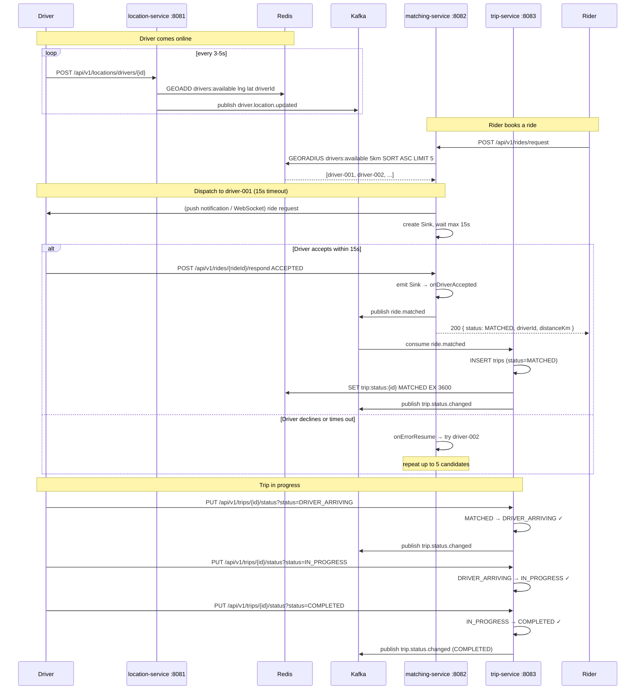

# Sequence Diagram — Happy Path Ride



## State Machine

```
MATCHED → DRIVER_ARRIVING → IN_PROGRESS → COMPLETED
   ↓              ↓               ↓
CANCELLED      CANCELLED      CANCELLED
```

Terminal states: `COMPLETED`, `CANCELLED` — no further transitions allowed (returns HTTP 409).
